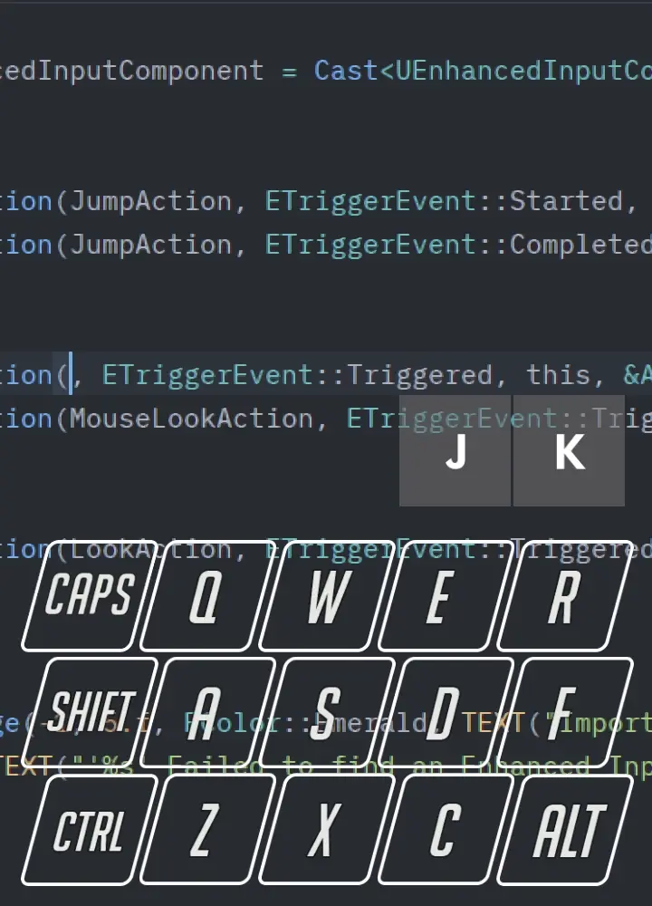
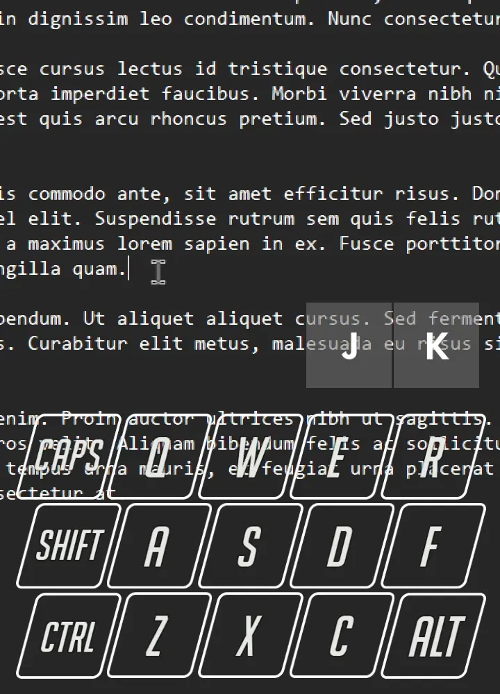
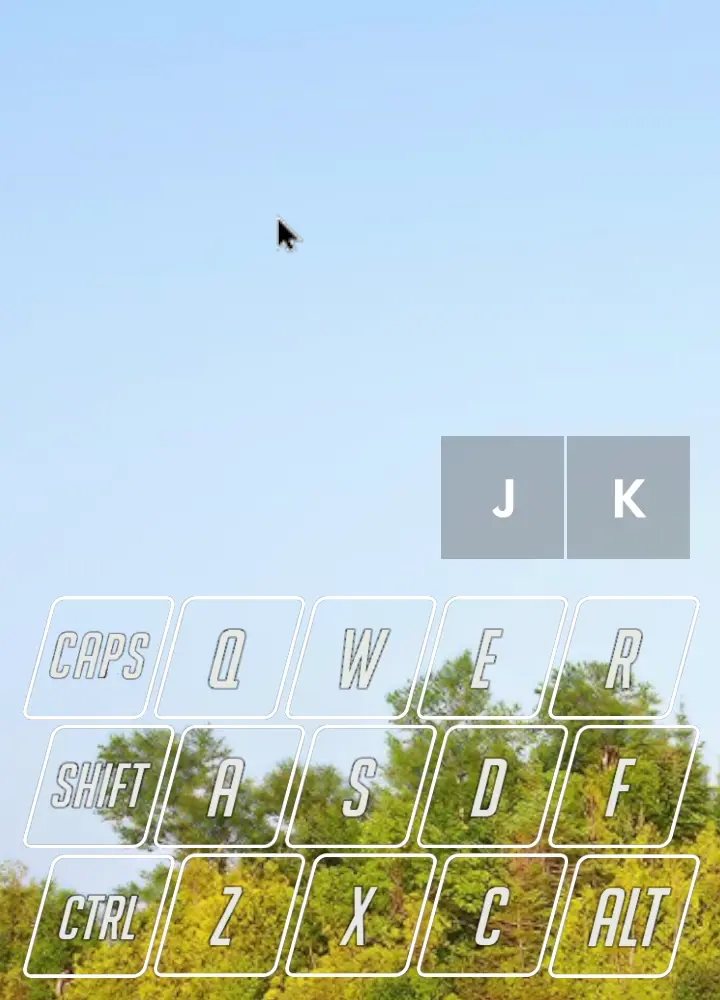
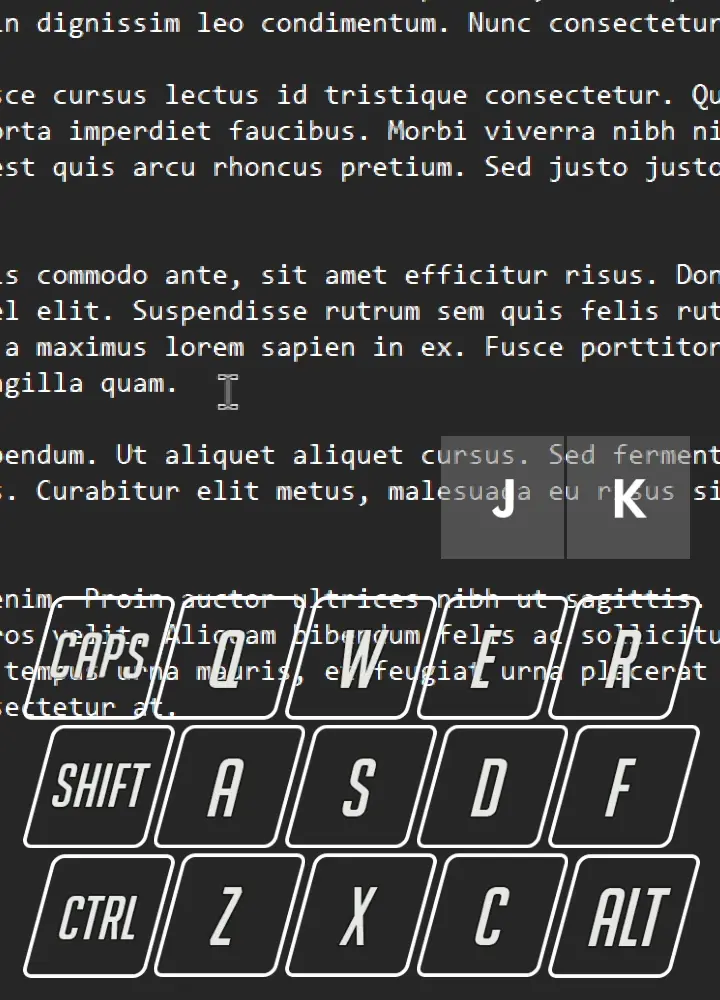
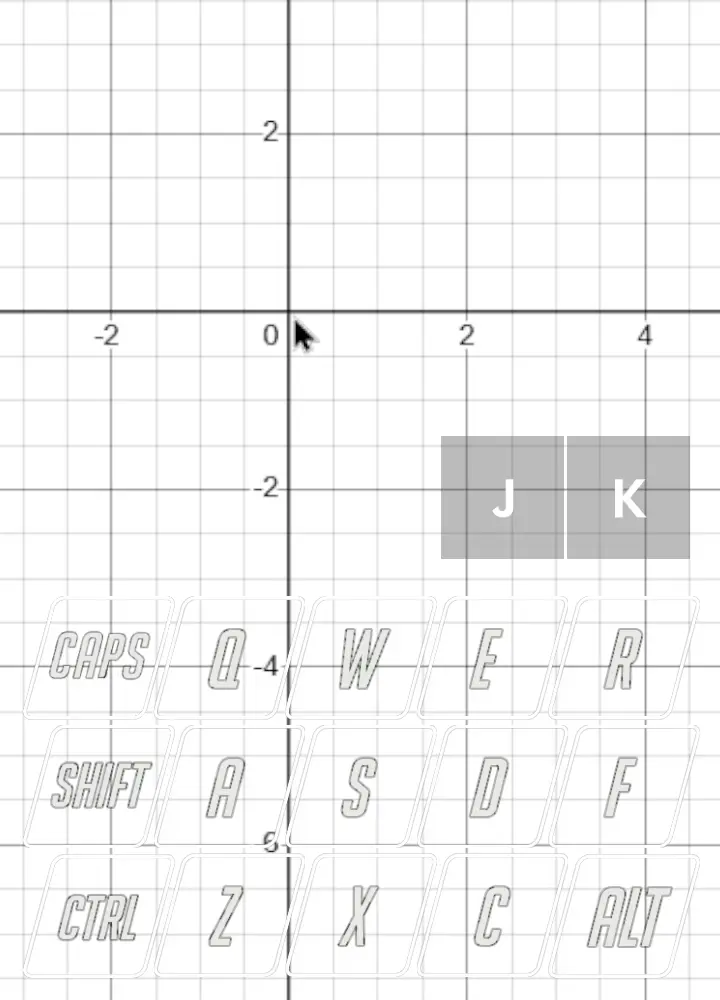
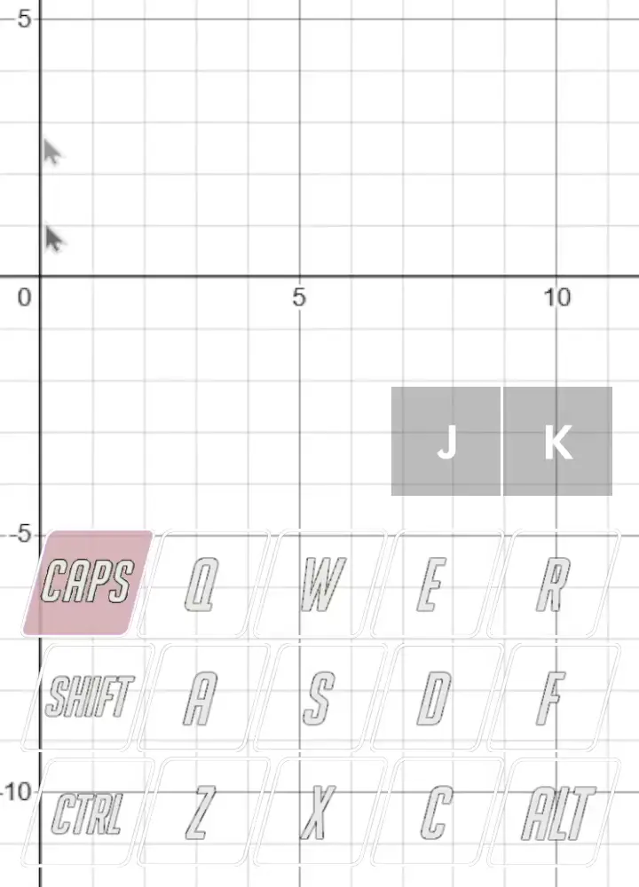
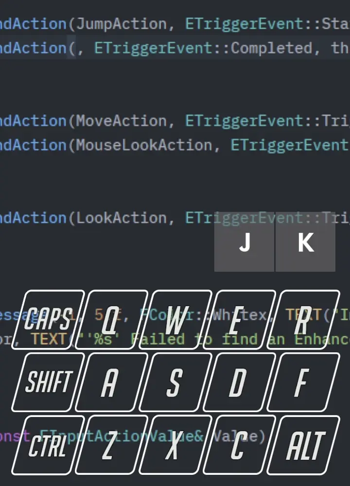
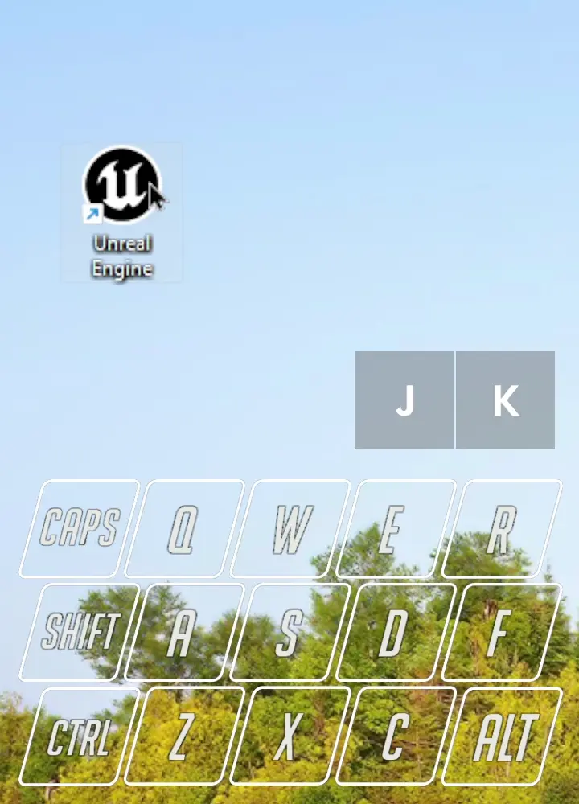
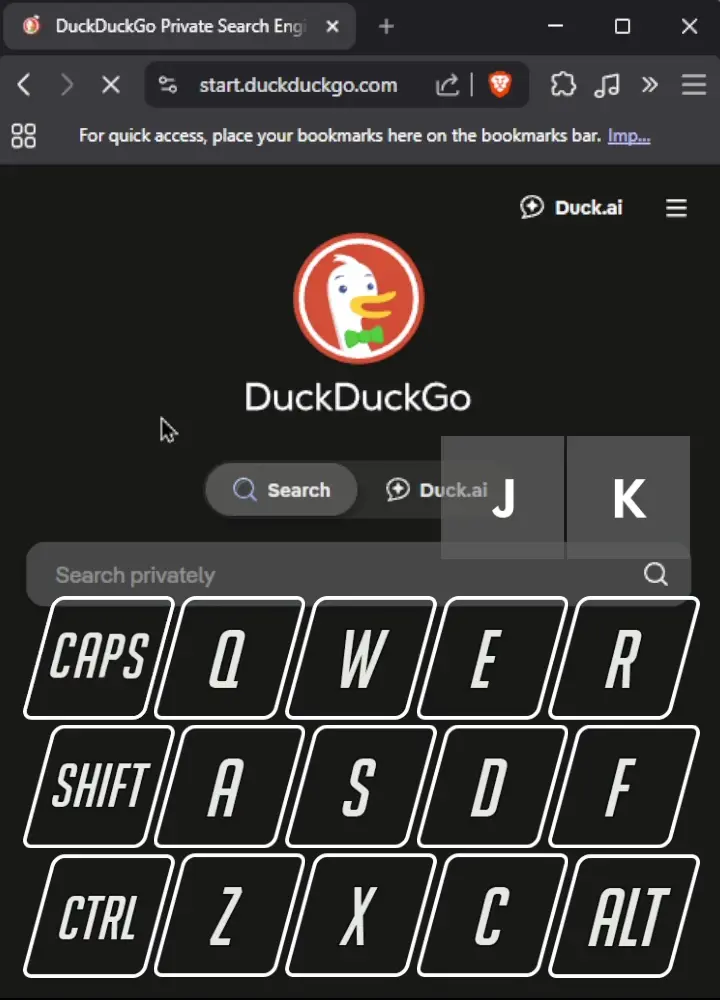
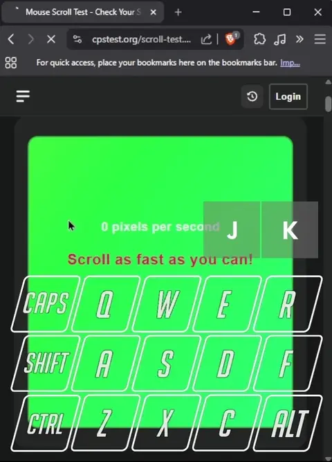

# K2M — Keyboard to Mouse

[](https://github.com/QuiToRiQ/K2M/actions/workflows/msvc-build.yml)

K2M lets you drive the mouse from the keyboard, so you can make quick edits without lifting your hand off the keys.

I kept reaching for the mouse just to nudge the cursor a few pixels or click a different line while coding, and that small back-and-forth adds up over a day. So I mapped the mouse onto `WASD` and a handful of nearby keys, all gated behind **Caps Lock** so it stays out of the way until you actually want it.

> Windows only. Written in C++ on the Win32 API.

## Demo



A small edit done without touching the mouse: move to the line with `WASD`, click into it with `J`, done. The overlay at the bottom shows which keys are pressed.

## Quick start

1. Build the executable (see [Building](#building)) or grab a release.
2. Put `config.ini` in the same folder as the `.exe`.
3. Run K2M. On first launch it asks once whether to start with Windows.
4. Hold **Caps Lock** and move the cursor with `WASD`. That's it.

## Controls

**Activation**

| Key | Action |
|---|---|
| `Caps Lock` | Hold to control the mouse while held (default), or press to toggle on/off — set by `bHoldCapsLock` |
| `Shift` + `Caps Lock` | Send a real Caps Lock toggle (the physical key is otherwise repurposed) |

<table align="center">
  <tr>
    <td align="center"><br><sub><b>Hold mode: hold Caps to mouse, release to type</b></sub></td>
    <td align="center"><br><sub><b>Toggle mode: tap Caps on, tap off</b></sub></td>
    <td align="center"><br><sub><b>Shift + Caps still toggles real caps</b></sub></td>
  </tr>
</table>

**While active**

| Key | Action |
|---|---|
| `W` `A` `S` `D` | Move the cursor (up / left / down / right) |
| Hold `Shift` / `Ctrl` / `Alt` | Accelerate movement |
| `J` or `Q` | Left click (hold to drag) |
| `K` or `E` | Right click |
| `C` | Middle click |
| `R` / `F` | Scroll up / down |
| `Z` | Back button, or `←` Left Arrow — set by `bUseArrows` |
| `X` | Forward button, or `→` Right Arrow — set by `bUseArrows` |

<table align="center">
  <tr>
    <td align="center"><br><sub><b>WASD movement</b></sub></td>
    <td align="center"><br><sub><b>Hold Shift to go faster</b></sub></td>
    <td align="center"><br><sub><b>Left & right click</b></sub></td>
    <td align="center"><br><sub><b>Hold J to drag</b></sub></td>
  </tr>
  <tr>
    <td align="center"><br><sub><b>Middle click</b></sub></td>
    <td align="center"><br><sub><b>Scroll, Ctrl for finer steps</b></sub></td>
    <td align="center"><br><sub><b>Back & forward in the browser</b></sub></td>
    <td></td>
  </tr>
</table>

## Configuration (`config.ini`)

All settings are optional; defaults are used if the file or a key is missing.

| Setting | Default | What it does |
|---|---|---|
| `bHoldCapsLock` | `true` | `true` = hold Caps Lock to activate; `false` = press it to toggle on/off |
| `bUseArrows` | `false` | `false` = `Z`/`X` are Back/Forward mouse buttons; `true` = `Z`/`X` are `←`/`→` arrow keys |
| `baseMouseSpeed` | `3` | Cursor step per tick, in pixels |
| `MouseAccelerationMultiplier` | `5` | Movement multiplier while `Shift`/`Ctrl`/`Alt` is held |
| `baseScrollSpeed` | `120` | Scroll step per tick |
| `ScrollAccelerationDivider` | `4` | Divides the scroll step for finer scrolling while `Ctrl`/`Alt` is held |

Example `config.ini`:

```ini
[settings]
bHoldCapsLock = true
bUseArrows = false
baseMouseSpeed = 3
MouseAccelerationMultiplier = 5
baseScrollSpeed = 120
ScrollAccelerationDivider = 4
```

## How it works

K2M installs a low-level keyboard hook (`WH_KEYBOARD_LL`). While active, it swallows the mapped keys so they don't type, and a separate thread polls their state about 100 times a second and synthesizes mouse input with `SendInput`. Caps Lock is intercepted and reused as the activation key, so its physical press never reaches Windows (injected Caps Lock events still pass through, which is how `Shift` + `Caps Lock` still works). Settings come from `config.ini`, a named mutex keeps a single instance running, and the app can register itself in the Windows startup key if you say yes on first launch.

## Notes & quirks

A few things that come from how Windows handles input — worth knowing:

* **Elevated windows are off-limits.** K2M runs at a normal integrity level, so Windows won't let it send input to elevated apps (Task Manager, UAC prompts, some installers). Run K2M as administrator if you need it there.
* **If the cursor gets stuck**, press `Ctrl`+`Alt`+`Del` and hit *Cancel*. That re-initializes the input stack and K2M starts responding again.
* **Renaming in File Explorer:** turning K2M off can hand focus to another window. Pressing `Alt` again brings focus back to where you were.
* **Physical Caps Lock is suppressed** while K2M is running — use `Shift` + `Caps Lock` when you actually want to toggle caps.

## Building

Windows only (it's built directly on the Win32 API). It's a single C++ source file and needs **C++17** for `std::filesystem`.

- **Visual Studio:** add the `.cpp` to an empty C++ project and build in Release.
- **MSVC command line:**
  ```bat
  cl /std:c++17 /EHsc /O2 main.cpp /link user32.lib advapi32.lib
  ```
- **No compiler handy?** Every push is built by GitHub Actions — grab `K2M.exe` from the latest run's artifacts on the [Actions tab](https://github.com/QuiToRiQ/K2M/actions).

It builds as a windowed (no-console) background app. Keep `config.ini` next to the resulting executable.
